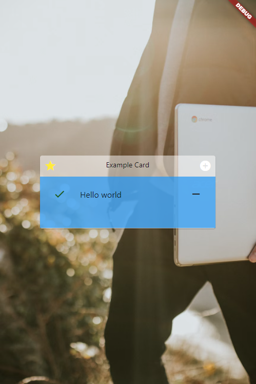

## Glassmorphism Card
A single card with glassmorphism style have header (with left, center, right item) with body (wrap a child content) by deeper color



## Usage

Add this in to your pubspec.yaml

```dart
glassmorphismcard: ^0.0.4
```

Import it
```dart
import 'package:glassmorphismcard/glassmorphismcard.dart';
```

Example

```dart
 GlassmorphismCard(
                backgroundColor: Colors.blue,
                title: Padding(
                  padding: const EdgeInsets.only(left: 15),
                  child: Text(
                    'Hello world',
                    style: TextStyle(
                        color: Colors.white,
                        fontSize: 30,
                        fontWeight: FontWeight.bold),
                  ),
                ),
                body: Align(
                    alignment: Alignment.bottomRight,
                    child: Image.network(img),
                    ),
              ),
```

