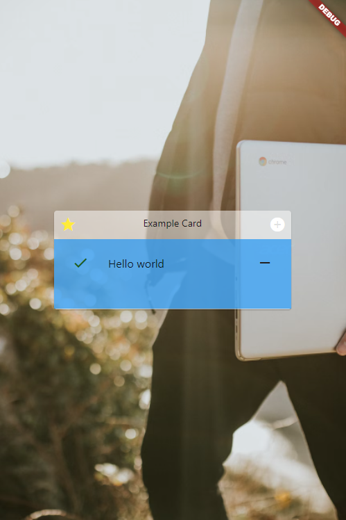

## Glassmorphism Card
A single card with glassmorphism style have header (with left, center, right item) with body (wrap a child content) by deeper color



## Usage

Add this in to your pubspec.yaml

```dart
glassmorphism_card: ^0.0.1
```

Import it
```dart
import 'package:glassmorphismcard/glassmorphismcard.dart';
```

Example

```dart
 GlassmorphismCard(
                  color_Header: Colors.white,
                  color_Body: Colors.blue,
                  leading: Icon(
                    Icons.star,
                    color: Colors.yellow,
                  ),
                  title: Text('Example Card'),
                  trailing: Icon(
                    Icons.add_circle,
                    color: Colors.white,
                  ),
                  body: ListTile(
                      leading: Icon(
                        Icons.done,
                        color: Colors.green[900],
                      ),
                      title: Text('Hello world'),
                      trailing: Icon(
                        Icons.remove,
                        color: Colors.grey[900],
                      )),
                ),
```

